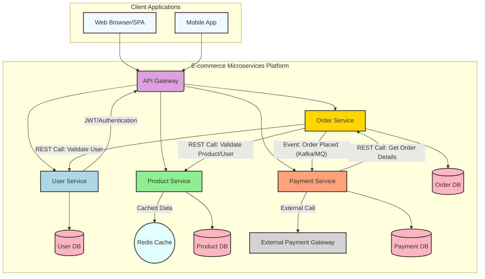

# E-commerce Microservices Platform 

## Project Overview

This repository hosts a simulated, production-grade e-commerce backend system built using a microservices architecture. Each core business domain (User, Product, Order, Payment) is implemented as an independent Spring Boot microservice, ensuring scalability, resilience, and maintainability.

The project demonstrates key backend engineering principles, including:
* **Microservices Design:** Isolated services with independent data schemas and REST contracts.
* **Secure API Development:** Implementation of JWT for stateless authentication and authorization.
* **Inter-Service Communication:** Synchronous RESTful calls and planned asynchronous event-driven communication (Kafka/RabbitMQ).
* **Data Persistence:** Leveraging Spring Data JPA with MySQL for robust data management.
* **Caching:** Integration of Redis for performance optimization (e.g., for product catalog data).
* **API Documentation:** Comprehensive API documentation using Springdoc OpenAPI (Swagger UI).
* **Containerization:** Local development and testing orchestrated with Docker.

This project aims to simulate real-world e-commerce workflows and provide a solid foundation for understanding scalable, distributed backend systems.

---

## Architecture Diagram 

The following diagram illustrates the high-level architecture of the e-commerce platform, showcasing the individual microservices, their dedicated databases, and their interaction patterns.


## Features Implemented (as of User Service completion) 

* **User Service (Authentication & Authorization):**
    * User registration and login with password hashing (BCrypt).
    * JWT token generation upon successful authentication for stateless sessions.
    * Role-based authorization (`ROLE_USER`, `ROLE_ADMIN`) with initial role seeding.
    * Secure API endpoints protected by JWT validation.
    * User profile retrieval (for self and admin access).
    * Robust input validation for DTOs.
    * Centralized exception handling for consistent error responses.
* **Database Integration:**
    * MySQL database configured for the User Service (`user_db`).
    * HikariCP for efficient and robust database connection pooling.
    * Spring Data JPA for simplified data access and ORM.
    * Automatic schema generation/updates using `ddl-auto=update` (for development).
* **API Documentation:**
    * Integrated Springdoc OpenAPI (Swagger UI) for interactive API documentation.
* **Core Backend Practices:**
    * Layered architecture (Controller, Service, Repository, Entity, DTO).
    * Lombok for reduced boilerplate code.
    * Spring Boot DevTools for enhanced developer experience.

## Getting Started 

### Prerequisites

* Java Development Kit (JDK) 17 or higher
* Apache Maven 3.8.x or higher
* Docker Desktop (for local orchestration and setting up MySQL/Redis containers)
* MySQL Server (version 8.0+)
* Postman (for API testing)

### Local Setup

1.  **Clone the Repository:**
    ```bash
    git clone [https://github.com/YOUR_USERNAME/ecommerce-platform-microservices.git](https://github.com/YOUR_USERNAME/ecommerce-platform-microservices.git)
    cd ecommerce-platform-microservices
    ```

2.  **Database Setup:**
    * Ensure your MySQL server is running on `localhost:3306`.
    * Create a database named `user_db` (or whatever is configured in `user-service/src/main/resources/application.properties`).
        ```sql
        CREATE DATABASE user_db;
        ```
    * Update the `src/main/resources/application.properties` file in `user-service` with your MySQL connection details (username, password, and database name).

3.  **Build All Microservices:**
    Navigate to the root of the project (`ecommerce-platform-microservices`) and run:
    ```bash
    mvn clean install -U
    ```

4.  **Run Individual Microservices (for development):**
    You can run the User Service from your IDE or by navigating into the `user-service` directory and running:
    ```bash
    java -jar target/user-service-0.0.1-SNAPSHOT.jar
    ```
    Once the User Service is running, you can access its Swagger UI at `http://localhost:8080/swagger-ui.html` (or the port you configured).

---

## Microservices Breakdown 

### 1. User Management Service
* **Port:** 8080 (default, configurable in `application.properties`)
* **Database:** `user_db`
* **Description:** Handles user registration, login, profile management, and role-based access control. Issues and validates JWTs for secure communication.
* **API Documentation (Swagger UI):** `http://localhost:8080/swagger-ui.html`

---

## Future Enhancements & To-Do List 

* **Implement Product Service:**
    * Define Product entity and repository.
    * Implement CRUD operations for products.
    * Integrate Redis caching for frequently accessed product data.
* **Implement Order Service:**
    * Define Order entity and repository.
    * Implement order creation, retrieval, and status updates.
    * Integrate synchronous REST calls to User and Product services for validation.
    * Implement asynchronous event publishing (Kafka/RabbitMQ) for "Order Placed" events.
* **Implement Payment Service:**
    * Define Payment entity and repository.
    * Consume "Order Placed" events from the Order Service.
    * Integrate with an external payment gateway (simulated or real).
    * Handle payment processing and status updates.
* **Implement API Gateway (Spring Cloud Gateway/Zuul):**
    * Centralized routing of requests to respective microservices.
    * Global JWT validation and authentication enforcement.
    * Rate limiting and circuit breaking.
* **Asynchronous Communication:**
    * Set up Kafka/RabbitMQ for inter-service communication (e.g., Order Placed events).
* **Monitoring & Logging:**
    * Integrate Prometheus/Grafana for monitoring.
    * Implement centralized logging with ELK Stack (Elasticsearch, Logstash, Kibana).
* **Containerization & Deployment:**
    * Finalize Dockerfiles for each service.
    * Complete `docker-compose.yml` for local multi-service orchestration.
    * Explore Kubernetes deployment.
* **Testing:**
    * Add comprehensive unit, integration, and end-to-end tests.
* **Error Handling & Resilience:**
    * Implement more robust global error handling.
    * Introduce resilience patterns (e.g., Retry, Circuit Breaker with Resilience4j).
* **Security Enhancements:**
    * Fine-grained role-based access control (RBAC) across all services.
    * Input validation and sanitization.
    * OAuth 2.0 flows for delegated access.

---

## Contributing 

Contributions are welcome! Please feel free to open issues or submit pull requests.

## License 📄

This project is licensed under the MIT License.
