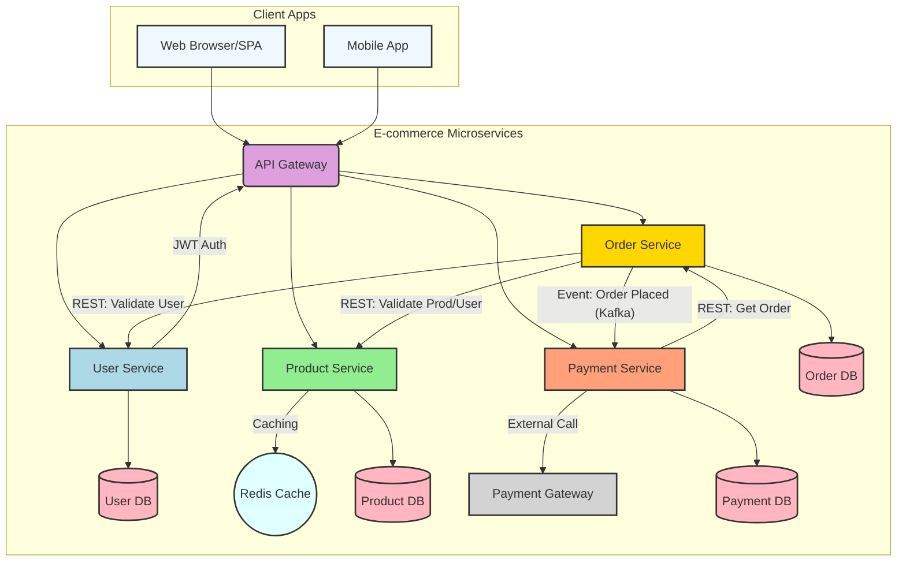

# E-commerce Microservices Platform 

## Project Overview

This repository hosts a simulated, production-grade e-commerce backend system built using a microservices architecture. Each core business domain (User, Product, Order, Payment) is implemented as an independent Spring Boot microservice, ensuring scalability, resilience, and maintainability.

The project demonstrates key backend engineering principles, including:
* **Microservices Design:** Isolated services with independent data schemas and REST contracts.
* **Secure API Development:** Implementation of JWT for stateless authentication and authorization.
* **Inter-Service Communication:** Synchronous RESTful calls and planned asynchronous event-driven communication (Kafka/RabbitMQ).
* **Data Persistence:** Leveraging Spring Data JPA with MySQL for robust data management.
* **Caching:** Integration of Redis for performance optimization (e.g., for product catalog data).
* **API Documentation:** Comprehensive API documentation using Springdoc OpenAPI (Swagger UI).
* **Containerization:** Local development and testing orchestrated with Docker.

This project aims to simulate real-world e-commerce workflows and provide a solid foundation for understanding scalable, distributed backend systems.


## Architecture Diagram 

The following diagram illustrates the high-level architecture of the e-commerce platform, showcasing the individual microservices, their dedicated databases, and their interaction patterns.


## Features Implemented 

* **User Service (Authentication & Authorization):**
    * User registration and login with password hashing (BCrypt).
    * JWT token generation upon successful authentication for stateless sessions.
    * Role-based authorization (`ROLE_USER`, `ROLE_ADMIN`) with initial role seeding.
    * Secure API endpoints protected by JWT validation.
    * User profile retrieval (for self and admin access).
    * Robust input validation for DTOs.
    * Centralized exception handling for consistent error responses.
* **Database Integration:**
    * MySQL database configured for the User Service (`user_db`).
    * HikariCP for efficient and robust database connection pooling.
    * Spring Data JPA for simplified data access and ORM.
    * Automatic schema generation/updates using `ddl-auto=update` (for development).
* **API Documentation:**
    * Integrated Springdoc OpenAPI (Swagger UI) for interactive API documentation.
* **Core Backend Practices:**
    * Layered architecture (Controller, Service, Repository, Entity, DTO).
    * Lombok for reduced boilerplate code.
    * Spring Boot DevTools for enhanced developer experience.

## Getting Started 

### Prerequisites

- Java Development Kit (JDK) 17 or higher
- Apache Maven 3.8.x or higher
- Docker Desktop (for running MySQL, Redis, and services)
- Postman (for API testing)
- IntelliJ IDEA (recommended for managing multiple run configurations)

---

### Environment Setup Options

#### Option 1: Run Entire Platform via Docker (Recommended)

This is the default and preferred method for running the entire microservices platform.

##### 1. Clone the Repository
```bash
git clone https://github.com/ravi2411rj/ecommerce-platform-microservices.git
cd ecommerce-platform-microservices
```

##### 2. Setup Environment Variables
Create a `.env` file in the root directory with the following variables:

```env
DB_USER=root
DB_USER_PASSWORD=your_password
JWT_SECRET_KEY=your_jwt_secret_key
```

> These variables are used in `docker-compose.yml` for DB and service startup.

##### 3. Build & Package All Microservices
```bash
mvn clean package -DskipTests
```

##### 4. Run All Services with Docker Compose
```bash
docker compose up --build
```

##### 5. Access Swagger UIs
- User Service → [http://localhost:8080/swagger-ui.html](http://localhost:8080/swagger-ui.html)
- Product Service → [http://localhost:8081/swagger-ui.html](http://localhost:8081/swagger-ui.html)
- Order Service → [http://localhost:8082/swagger-ui.html](http://localhost:8082/swagger-ui.html)
- Payment Service → [http://localhost:8083/swagger-ui.html](http://localhost:8083/swagger-ui.html)

---

#### Option 2: Run Services Locally via IntelliJ (For Development)

You can run individual services in IntelliJ using **Spring Profiles**.

##### 1. Profile Setup
- Each service includes:
  - `application.properties` → shared config
  - `application-local.properties` → for local runs
  - `application-docker.properties` → for Docker

##### 2. IntelliJ Run Config
In IntelliJ:
- Set **VM Options** for each service run config:
  ```
  -Dspring.profiles.active=local
  ```
- Set **Environment Variables**:
  ```
  DB_USER=root
  DB_USER_PASSWORD=your_password
  JWT_SECRET_KEY=your_jwt_secret_key
  ```

##### 3. Database Setup
Ensure MySQL is running. The Docker setup exposes MySQL on host port `3308`, so connect to `localhost:3308` when using the provided `docker-compose.yml`. If running MySQL locally, use the default `localhost:3306`. Then create the required databases:

```sql
CREATE DATABASE user_db;
CREATE DATABASE product_db;
CREATE DATABASE order_db;
CREATE DATABASE payment_db;
```

##### 4. Redis Setup (optional for product-service)
If testing Redis locally, run:
```bash
docker run --name redis_dev -p 6378:6379 -d redis:7.0-alpine
```

##### 5. Build and Run Individual Services
```bash
mvn clean install -U
cd user-service
java -jar target/user-service-0.0.1-SNAPSHOT.jar
```

You can repeat the above for `product-service`, `order-service`, and `payment-service`.

---

### Microservice Modules

| Service         | Port | Description                  |
|-----------------|------|------------------------------|
| user-service    | 8080 | Handles user registration/login, JWT authentication |
| product-service | 8081 | Manages products and uses Redis caching |
| order-service   | 8082 | Handles orders and integrates user & product services |
| payment-service | 8083 | Manages payment and order confirmation |

---

### Notes

- Services use **Spring Profiles** to load correct configs (`local`, `docker`).
- `docker-compose.yml` handles orchestration, DB creation, and environment setup.
- Redis is used by the Product Service for caching.

---

### Cleaning Up

To stop and remove containers:
```bash
docker compose down --volumes --remove-orphans
```

## Future Enhancements & To-Do List

* **Implement API Gateway (Spring Cloud Gateway/Zuul):**
    * Centralized routing of requests to respective microservices.
    * Global JWT validation and authentication enforcement.
    * Rate limiting and circuit breaking.
* **Asynchronous Communication:**
    * Set up Kafka/RabbitMQ for inter-service communication (e.g., beyond just "Order Placed" events).
* **Monitoring & Logging:**
    * Integrate Prometheus/Grafana for monitoring.
    * Implement centralized logging with ELK Stack (Elasticsearch, Logstash, Kibana).
* **Containerization & Deployment:**
    * Explore Kubernetes deployment.
* **Testing:**
    * Add comprehensive unit, integration, and end-to-end tests.
* **Error Handling & Resilience:**
    * Implement more robust error handling.
    * Introduce resilience patterns (e.g., Retry, Circuit Breaker with Resilience4j).
* **Security Enhancements:**
    * Fine-grained role-based access control (RBAC) across all services.
    * Input validation and sanitization.
    * OAuth 2.0 flows for delegated access.

## Contributions

Contributions are welcome! Please feel free to open issues or submit pull requests.

## License

This project is licensed under the MIT License.
